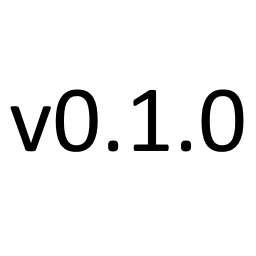

# Vacuum Orchestrator



Vacuum Orchestrator manages persistent cleaning jobs, canonical rooms and one
shared queue for up to 20 robot vacuums in Home Assistant. It supports operation
without a robot while you configure rooms and prepare jobs. A dashboard card is
optional: the backend owns all decisions and exposes Home Assistant actions.

## Status and installation

Version `0.1.0` is a development version, tested against Home Assistant
`2026.9.0` with Python `3.14.2`. Production deployment and release validation
are not yet complete.

For evaluation, copy `custom_components/vacuum_orchestrator` into your Home
Assistant `custom_components` directory, restart Home Assistant, then add
**Vacuum Orchestrator** in **Settings → Devices & services**. HACS metadata and
validation workflows are included; this does not imply acceptance in the HACS
catalogue or a published release.

Setup imports HA areas and discovers registered vacuum entities. New rooms are
locked. Automatic job generation is disabled until explicitly enabled on a
saved template. Discovery alone cannot start cleaning.

## Rooms and cleaning modes

A room has a persistent VOI ID, an optional HA area and floor, robot-specific
map/target bindings, release rules, conditions and cleaning history. Renaming an
HA area preserves history. Removing its area blocks new cleaning until the
binding is repaired. `remove_room` disables the room and preserves its history;
it also prevents automatic reactivation during area discovery.

Exactly four cleaning modes are supported:

| Mode | Meaning |
|---|---|
| `vacuum` | Vacuum only |
| `mop` | Mop only |
| `vacuum_and_mop` | Vacuum and mop in one simultaneous operation |
| `vacuum_then_mop` | Vacuum first, then mop in a dependent phase |

The aliases `vac`, `vac_and_mop` and `vac_then_mop` are accepted on input.
Different robots may carry out the two sequential phases. Simultaneous cleaning
is never silently changed into sequential cleaning.

Optional settings are `vacuum_power`, `mop_intensity` and `mop_route`.
`settings_policy: strict` requires their exact support; `best_effort` may omit
unsupported optional settings and reports the omissions. Neither policy changes
the requested rooms, cleaning mode or phase order. `passes` is 1–10 at the job
boundary; the selected robot must support the requested count.

## Robot configuration

Open a robot subentry to configure or reconfigure it. The same validator backs
`add_robot` and `configure_robot`. `get_robot_candidates` shows discovery results;
`get_robots` shows configuration and effective capabilities. Busy robots cannot
be reconfigured or removed through these commands. Removing an idle profile
excludes it from automatic rediscovery; it can be added manually again.

The advanced configuration object accepts:

| Fields | Purpose |
|---|---|
| `enabled`, `allowed_operations` | Enable a profile and restrict its physical operations |
| `roles` | Map companion entities such as battery, mode, error and selected map |
| `target_areas` | Select existing HA area mappings |
| `fixed_mode` | Explicit operation for a device whose mode cannot be selected |
| `mode_options` | Map `vacuum`, `mop`, `vacuum_and_mop` to actual select options |
| `vacuum_levels`, `water_levels`, `mop_routes` | Map semantic preferences to actual device options |
| `minimum_battery`, `preference` | Minimum charge and selection preference (-100…100) |
| `requirements` | State conditions, optionally restricted to an operation |
| `start_timeout_seconds`, `run_timeout_seconds` | Cleaning start and execution limits |
| `cancel_timeout_seconds`, `settle_seconds` | Stop confirmation and normal-end stability window |
| `settings_timeout_seconds` | Confirmation limit for settings changes |
| `protocol`, `map_options` | Explicit supported protocol and map-option mapping |
| `physical_robot_id` | Shared identity for aliases that cannot be automatically recognized |

Default limits are 180 seconds for start, 14,400 for execution, 120 for stop,
30 for settling and 45 for a setting. Each limit must be positive and at most
86,400 seconds. Changing a profile does not rewrite historical attempts.

Entity roles use stable registry identities, so entity renaming is supported.
Omitting a role from a replacement `roles` object restores automatic discovery;
setting it to `null` explicitly disables that role. Ambiguous roles are left
unassigned. Robot and dock discovery uses device identifiers, not similar names.

A generic HA/Matter vacuum needs room addressing, a known cleaning mode and
supported stopping. `CLEAN_AREA` alone does not prove a mode. Configure
`fixed_mode` only when it describes how the device actually cleans, or provide a
`cleaning_mode` role and `mode_options`. Unsupported combinations remain blocked.
Generic HA dispatch supports one pass. Detected Roborock V1 profiles use public
map inventory and native segment commands with up to three passes. Other
Roborock profiles use only their supported HA area path. VOI does not change
maps automatically; targets on another or unknown map remain unavailable.

For a custom VOI room, add robot bindings with `update_room`. A native Roborock
binding uses `robot_id`, `map_id` and `target_ids` containing segment IDs. Generic
HA bindings refer to mapped HA area IDs. Multiple targets may form one room.
Overlapping target aliases within a robot's mapping are rejected as ambiguous.
The same physical room should use the same canonical VOI room across robots.

## Room releases and queue runs

`release_room` supports four `kind` values:

| Kind | Lifetime |
|---|---|
| `permanent` | Until explicitly revoked or replaced |
| `once` | Exactly one actually started job, including its subsequent phases |
| `timed` | Until `duration_seconds` has elapsed |
| `queue_run` | Until the current, or next started, queue run finishes |

A once-only release is reserved during preparation. A proven failure before
start returns the reservation; an uncertain start retains it until recovery.
A new retry job needs a new release. Replacing a release gives it a new identity,
so a delayed old result cannot consume the replacement.

Expiration or revocation prevents new jobs. A job that has already started may
finish all its phases; current door and device conditions are still checked
before each phase. Use `cancel_job` to stop a started job.

A queue run begins with `run_queue` or `resume_queue`. It ends when no started
jobs remain unresolved and no queued jobs are currently executable for the
entire grace period. **Blocked queued jobs may remain in the queue.** The default
grace period is **15 minutes**. New executable work clears the waiting period;
appended or reordered jobs belong to the same run. A queue pause preserves the
run and its releases; after resuming, a new quiet interval is required.

`configure_queue` sets `grace_seconds` from 0 to 86,400 for future runs. A running
session retains its captured duration. Run identity and idle deadline survive
restart. At run completion VOI returns to `idle` and revokes only releases still
bound to that run; permanent and subsequently replaced releases are retained.

## First job

Use `get_rooms` and `get_robots` to obtain IDs and check mappings. In these
examples, replace `ROOM_ID` with the actual room ID; an existing HA area ID is
also accepted as a room reference.

```yaml
action: vacuum_orchestrator.release_room
data:
  room_id: ROOM_ID
  kind: queue_run
```

```yaml
action: vacuum_orchestrator.create_job
data:
  areas: [ROOM_ID]
  mode: vacuum_then_mop
  name: Office cleaning
  vacuum_power: high
  settings_policy: best_effort
response_variable: created_job
```

```yaml
action: vacuum_orchestrator.run_queue
```

Alternatively, call `start_job` with the returned `job_id` and an optional
`robot_id`. Direct starts use the same conditions and capability checks.
`move_job` needs only `job_id` and `direction: up|down|top|bottom`.

`pause_queue` prevents new automatic job starts and lets started jobs finish
all phases. `cancel_job` cancels pending work or requests a safe stop. A service
response acknowledges the command; completion is determined from observations.

## Conditions, due state and completion quality

Room `requirements` can express doors and passages, with `entity_id`,
`accepted_states` and optional `robot_id`, `operation`, `max_age_seconds`.
Robot requirements use the same fields. There are no inferred floor-plan or
door rules. Unknown or unavailable required states block dispatch. A stable door
state is not stale unless an age limit was explicitly configured.

Configure each room's `due_policy` with `basis: calendar` or `basis: occupied`
and independent `vacuum_seconds` and `mop_seconds` intervals. An interval of
`null` disables that operation's due calculation. Occupied time also uses an
`occupancy_entity_id`, `occupied_state` (default `on`) and `unoccupied_state`
(default `off`). Unknown intervals and restart gaps are reported; they are not
counted as unoccupied. A source change starts a new counter epoch. Remaining
usage time is not presented as a predicted calendar deadline.

For VOI-started cleaning, an observed cleaning start followed by a stable normal
end can produce **derived** completion. Errors, disconnects and timeouts cannot
produce success. A short dock visit is not immediately treated as completion.
Room values retain the quality of the underlying evidence and independently
keep the last **confirmed** completion. Later proof may upgrade the same receipt
without counting the cleaning twice. A failed mop phase preserves an earlier
successful vacuum phase.

External cleaning is recorded separately. It updates room values only with
unambiguous target, mode and successful-completion proof and an unchanged target
mapping. Public HA history timestamps alone do not supply that proof. The shipped
HA/Roborock observation paths generally derive own-job completion and retain
external runs as history only; they do not access private integration internals.

## Templates and automatic demand

`save_template` takes `name`, an `intent` using the `create_job` fields, optional
`template_id`, `enabled` (default `true`) and `automatic` (default `false`). It
replaces the saved definition. `create_job_from_template` creates an independent
job snapshot; editing or removing the template cannot change existing jobs.

An automatic template creates one job per due room and demand episode. It waits
while live work overlaps the requested operations. Failed, cancelled or deleted
automatic jobs do not trigger an unlimited retry loop: demand suppression
survives restart until all requested operations become fresh/disabled or
`reset_template_demand` explicitly permits another demand. Multiple automatic
templates have separate demand records. Job generation does not start an idle
queue or release locked rooms.

## Actions and diagnostics

All actions use the `vacuum_orchestrator` domain. Write actions require an admin
when called with a user context; HA automation contexts are supported. Query
actions require a response. Lists accept `offset` and `limit` (default 50,
maximum 100).

| Area | Actions |
|---|---|
| Jobs | `create_job`, `update_job`, `delete_job`, `move_job`, `start_job`, `cancel_job`, `retry_job`, `get_job` |
| Queue | `run_queue`, `pause_queue`, `resume_queue`, `configure_queue`, `get_queue` |
| Rooms | `create_room`, `update_room`, `remove_room`, `release_room`, `revoke_room`, `get_rooms`, `get_room` |
| Robots | `add_robot`, `configure_robot`, `remove_robot`, `get_robots`, `get_robot_candidates` |
| Templates | `save_template`, `remove_template`, `create_job_from_template`, `reset_template_demand`, `get_templates` |
| Diagnostics | `get_job_execution`, `get_history`, `get_trace`, `get_diagnostics`, `resolve_recovery` |

`get_job_execution` explains current conditions per robot and phase, setting
omissions and attempt outcomes. `get_queue.recovery_targets` identifies unresolved
ownership. `resolve_recovery` verifies a stopped robot, or accepts
`confirm_stopped: true` after you have verified the physical stop. Recovery
abandons uncertain work; it never asserts successful cleaning. Independent
robots can continue while another requires attention.

Trace history keeps at most 512 runtime records. Diagnostic downloads anonymize
identifiers and exclude names, notes, credentials and full device payloads;
job/room sections are capped at 500 entries with totals. Repairs identify
persistent configuration and recovery problems. A closed door is an ordinary
blocker, not a Repair.

Each room has seven optional entities, disabled by default: a release switch
and, separately for vacuum and mop, last cleaning, elapsed seconds and due state.
The switch turns on a permanent release and revokes it when turned off. Other
release types are selected through `release_room`. Summary entities expose
queue mode/length, active jobs and attention counts.

## Client API and validation

The authenticated API remains version 2:

- `vacuum_orchestrator/queue/get`, `job/get`, `jobs/list` and `subscribe`;
- `vacuum_orchestrator/configuration/get` with `query` and `parameters`;
- `vacuum_orchestrator/configuration/command` with `command` and `parameters`.

Configuration query/command names and schemas are shared with their HA actions.
Subscriptions carry `runtime_id`, `runtime_sequence` and persisted `commit_id`;
clients should refresh paginated snapshots after reconnect or a detected gap.
The `vacuum_orchestrator_state_changed` HA event is a versioned invalidation
notification. Existing readiness enums remain compatible: stale requirements
appear as `unknown` at the old summary boundary, with detailed reasons available.

[API v2 consumer fixtures](tests/fixtures/contracts/README.md) protect existing
response fields. The test suite includes device fakes, replay fixtures, property
tests, persistence fault injection and a 20-robot isolation scenario. No physical
robot is needed. The Linux workflow runs pytest with a 95% coverage gate, Ruff,
format checks, strict mypy, Hassfest and HACS validation.

On Linux with Python 3.14.2:

```sh
python -m pip install -r requirements-test.txt
python -m pytest
python -m ruff check custom_components tests
python -m ruff format --check custom_components tests
python -m mypy custom_components
```

Current limits include automatic vacuum-freshness prerequisites before mopping,
adaptive splitting of one job, queue consolidation, and production migration
from existing cleaning automations. They are not provided by this version.

## License

Vacuum Orchestrator is licensed under the MIT License. See [LICENSE](LICENSE).
